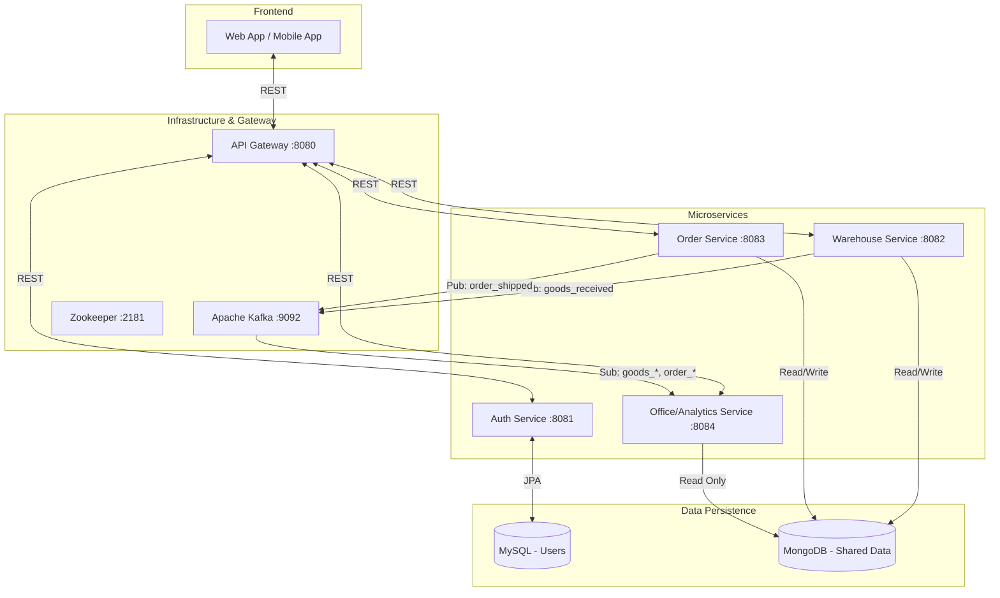
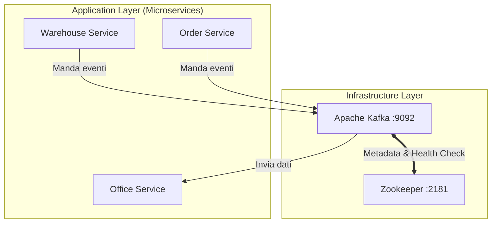

# Progetto: Smart Agri-Food WMS (Warehouse Management System)

## 1 - Infrastruttura, tecnologie, linguaggi e requisiti

### Introduzione

L'obiettivo di questo documento è descrivere le modalità di realizzazione di un sistema di gestione magazzino (WMS) focalizzato sul settore ortofrutticolo. Il progetto pilota prevede la gestione di prodotti deperibili, dove la priorità di uscita è dettata dalla logica FEFO (First-Expired-First-Out) e la merce è quantificata a Peso (Kg).

Il sistema è progettato come un'architettura a Microservizi orientata agli eventi (Event-Driven), persistenza NoSQL e comunicazione asincrona.

### Funzionalità e Requisiti

Il sistema prevede due interfacce principali: una **Desktop** per l'ufficio (gestione ordini e anagrafiche) e una **Mobile** per gli operatori di magazzino (ingresso merce, picking).

#### Requisiti Funzionali

- **Gestione Anagrafiche:** L'ufficio deve poter inserire nuovi prodotti nel catalogo (es. "Mele Golden", "Pere Abate") assegnando un ID univoco.
- **Ingresso Merce:** Il magazziniere deve poter registrare l'ingresso di un lotto scansionando il barcode e inserendo peso totale e data di scadenza.
- **Logica FEFO:** Il sistema deve calcolare automaticamente quali lotti prelevare in base alla data di scadenza più prossima.
- **Gestione Ordini e Peso:** L'ufficio deve poter creare ordini specificando il peso richiesto. Il sistema deve poter "spezzare" i lotti, prenotando solo la quantità necessaria (gestione parziale del peso).
- **Picking:** Il magazziniere deve visualizzare una lista di prelievo ottimizzata e confermare l'avvenuto stoccaggio o spedizione.
- **Dashboard Real-time:** L'ufficio deve visualizzare le statistiche aggiornate tramite eventi asincroni (merce in scadenza, movimenti).

#### Requisiti Non Funzionali
- **Usabilità:** L'interfaccia mobile deve prevedere elementi di interazione (bottoni) di dimensioni adeguate all'uso con guanti da lavoro e fornire feedback sonori per le conferme di lettura.
- **Scalabilità:** Il sistema deve poter gestire un aumento del carico di richieste (es. picchi mattutini) senza degradare le prestazioni, permettendo l'aggiunta di nuove istanze dei servizi.
- **Portabilità:** Il sistema deve essere agnostico rispetto all'infrastruttura sottostante (cloud o on-premise).
- **Resilienza:** Il sistema deve garantire la continuità operativa del magazzino (inserimento dati) anche in caso di momentanea indisponibilità della rete o dei servizi di reportistica.
- **Performance:** I tempi di risposta alla scansione non devono superare i 500ms.

### Tecnologie Adottate

- **Frontend:** Web Application Responsive (React/Angular o HTML+JS) con librerie di scansione barcode (es. `html5-qrcode`).
- **Backend:** Java 17+ con Framework **Spring Boot 3**.
- **Database:**
    I) **MySQL:** Per la gestione utenti e autenticazione (dati strutturati).
    II) **MongoDB:** Per l'Operational Data Store (Lotti, Ordini) in modalità _Shared Database_ per flessibilità dello schema.
- **Message Broker:** **Apache Kafka** + Zookeeper per la gestione degli eventi (`goods_received`, `order_shipped`).
- **Deployment:** Docker Compose.

### Diagramma di Architettura del Sistema






### Tabella Metodi REST (Esempi Significativi)

| **Endpoint**          | **Metodo** | **Descrizione**            | **Parametri Input (Body/Query)**                              | **Output Esempio**                           |
| --------------------- | ---------- | -------------------------- | ------------------------------------------------------------- | -------------------------------------------- |
| `/auth/login`         | POST       | Login operatore            | `{user, pass}`                                                | `{token: "jwt_xyz", role: "WAREHOUSE"}`      |
| `/api/products`       | POST       | Crea Anagrafica Prodotto   | `{sku: "M01", name: "Mele Golden"}`                           | `201 Created`                                |
| `/api/batches`        | POST       | Ingresso Merce (Carico)    | `{productId: "M01", weight: 100, expiry: "2024-12-31"}`       | `{batchId: "xyz", status: "STORED"}`         |
| `/api/orders`         | POST       | Creazione Ordine (Ufficio) | `{customer: "Coop", items: [{productId: "M01", weight: 40}]}` | `{orderId: "abc", status: "PENDING"}`        |
| `/api/stock/expiring` | GET        | Lista merce in scadenza    | `?days=7`                                                     | `[{product: "Mele", expiry: "...", kg: 50}]` |

---

## 2 - Progettazione del database

### Impostazione Database

Il sistema utilizza un approccio "Polyglot Persistence".

1. **MySQL:** Utilizzato per il servizio di Autenticazione (`Auth Service`), dove la struttura dei dati (Utenti, Ruoli) è rigida e relazionale.
2. **MongoDB:** Utilizzato come database operativo condiviso (_Shared Database Pattern_) per `Warehouse`, `Order` e `Office` Service. Questa scelta, pur creando un accoppiamento a livello dati (Distributed Monolith), è funzionale per evitare la complessità delle transazioni distribuite (SAGA), mantenendo flessibilità sullo schema dei lotti e degli ordini.

### Data Model (MongoDB - Collezioni Principali)

Abbiamo affinato il modello per gestire l'anagrafica separata e il peso parziale dei lotti.

Collezione: products (Catalogo)
Serve a normalizzare i nomi dei prodotti.

```json
{
  "_id": "ObjectId('...p1')",
  "sku": "APP-GOLD",
  "name": "Mele Golden Delicious",
  "description": "Mele calibro 80/85, origine Italia"
}
```

Collezione: batches (Lotti di Magazzino)

Include la logica di peso parziale per gestire lo "spezzettamento" dei lotti senza duplicarli.


```json
{
  "_id": "ObjectId('...b1')",
  "barcode": "BATCH-2023-001",
  "productId": "ObjectId('...p1')", // Riferimento al catalogo
  "expiryDate": ISODate("2023-12-31T00:00:00Z"), // Chiave per FEFO
  "entryDate": ISODate("2023-11-01T10:00:00Z"),
  "initialWeightKg": 100.0,
  "currentWeightKg": 60.0,   // Peso fisico rimasto
  "reservedWeightKg": 0.0,   // Peso temporaneamente bloccato per ordini in corso
  "status": "AVAILABLE",     // AVAILABLE, EMPTY
  "location": { "zone": "A", "aisle": "2" }
}
```

**Collezione: `orders` (Ordini)**


```json
{
  "_id": "ObjectId('...o1')",
  "customer": "Supermercato ABC",
  "status": "PROCESSING",
  "items": [
    {
      "productId": "ObjectId('...p1')",
      "requestedWeight": 40.0,
      "allocations": [ // Tracciabilità di quali lotti soddisfano la richiesta
        { "batchId": "ObjectId('...b1')", "weightTaken": 40.0 }
      ]
    }
  ]
}
```

### Query ed Aggregazioni di Esempio

1. Query FEFO (Selezione lotti per scadenza)

Questa query cerca i lotti del prodotto richiesto che hanno peso disponibile (current > reserved), ordinandoli per scadenza crescente.


```javascript
db.batches.find({
    "productId": ObjectId("...p1"),
    "status": "AVAILABLE",
    "$expr": { "$gt": ["$currentWeightKg", "$reservedWeightKg"] }
}).sort({ "expiryDate": 1 })
```

**2. Aggregazione Giacenze Totali per Prodotto**


```javascript
db.batches.aggregate([
    { $match: { status: "AVAILABLE" } },
    { $group: {
        _id: "$productId",
        totalKg: { $sum: "$currentWeightKg" }
    }}
])
```

---

## 3 - Mockup grafico, usabilità e accessibilità

### Indicazioni su UX e Accessibilità

- **Web App (Ufficio):** Interfaccia "Data-Dense". Tabelle con filtri rapidi, utilizzo di modali per la creazione ordini. Contrasto elevato per la lettura rapida dei dati critici (es. date di scadenza in rosso).
- **Mobile App (Magazzino):**
    - **Touch Targets:** Pulsanti di azione (Conferma, Stampa) di grandi dimensioni per facilitare l'uso con guanti da lavoro.
    - **Feedback:** Feedback sonoro e vibrazione alla scansione corretta o errata del barcode.
    - **Contrasto:** Modalità "High Contrast" per visibilità in celle frigorifere o zone d'ombra.

### Elenco Wireframe

1. **Login:** Selezione ruolo (Ufficio/Magazzino).
2. **Home Magazziniere:** Tasti rapidi "Ingresso Merce", "Picking Ordini".
3. **Scan Ingresso:** View della fotocamera con overlay di scansione e form peso manuale.
4. **Dashboard Ufficio:** Grafici a torta (Merce in scadenza) e lista ultimi ordini.
5. **Creazione Ordine:** Selezione cliente, aggiunta righe prodotto con peso, autocalcolo disponibilità.

---

## 4 - Suddivisione e gestione del Lavoro

### Ruoli Necessari

Considerando la natura didattica del progetto, i ruoli coprono l'intero stack:

- **Backend Developer:** Sviluppo microservizi Spring Boot, logica FEFO, integrazione Kafka.
- **Frontend/Mobile Developer:** Sviluppo WebApp React e integrazione librerie scanner JS.
- **DevOps/Architect:** Configurazione `docker-compose`, setup MongoDB/MySQL e Kafka, documentazione API.

### Strumenti

- **Version Control:** Git (GitHub/GitLab).
- **Project Management:** Trello o Jira (Kanban board per le User Stories).
- **Communication:** Slack/Discord.

### Gestione MVP (Minimum Viable Product)

1 Inserimento Prodotto -> 2. Carico Magazzino -> 3. Creazione Ordine -> 4. Scarico FEFO -> 5. Aggiornamento Dashboard.

Le funzionalità accessorie (gestione resi, statistiche avanzate) sono demandate a fasi successive.
